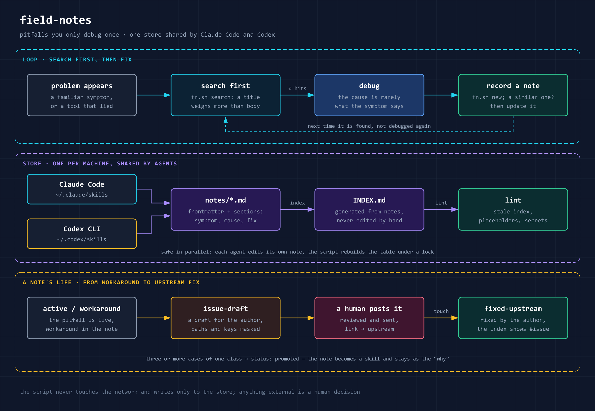

# field-notes


A skill for keeping engineering field notes — findings that outlive a single project: root cause,
workaround, a tool's pitfalls, candidates for new skills. It works the same way in **Claude Code**
and **Codex CLI**: both use the `SKILL.md` format, so the repository is linked into both skill
folders, and there is one store of notes per machine — what one agent records, the other finds.

[Русская версия](README.ru.md)

The repository holds **only the skill**. The notes themselves stay local and never go into git:
they contain concrete paths, versions and project details.

Its big brother for Hermes Agent is [hermes-field-notes](https://github.com/itpartypattaya/hermes-field-notes):
the same notes plus a registry of local core patches and a Telegram dashboard.

## Install

```bash
git clone https://github.com/itpartypattaya/field-notes.git
```

Windows:

```
pwsh -File install.ps1
```

Linux / macOS:

```
sh install.sh
```

The installer creates a junction (symlink) at `~/.claude/skills/field-notes` and
`~/.codex/skills/field-notes` for whichever agents are installed, and creates an empty store if
there is none. To update, `git pull` in this folder; both agents pick it up.

Requires **Python 3.9+** (standard library only). `fn.sh` picks the interpreter itself:
`$FIELD_NOTES_PYTHON` → `py -3` → `python3` → `python`, test-running each one — the Microsoft
Store `python3` stub is on PATH but does not work. Without Python only `root`, `init`, `new`,
`grep` and `list` remain.

## The store

The root is chosen in this order, first match wins:

1. `$FIELD_NOTES_DIR`
2. `~/.claude/field-notes`
3. `~/.codex/field-notes`
4. otherwise `~/.claude/field-notes` is created

```
<root>/
├── INDEX.md            generated from the notes by `index`, never edited by hand
└── notes/
    └── YYYY-MM-DD-short-slug.md   frontmatter + sections
```

Note format and what `lint` checks: [`references/note-format.md`](references/note-format.md)
(in Russian, like the skill itself).

If an agent's global instructions (`~/.codex/AGENTS.md`, `~/.claude/CLAUDE.md`) already name
their own notes folder, point them at the same root or at `$FIELD_NOTES_DIR`: an agent trusts its
own instructions before a skill and will silently use a second store.

## When it triggers

On requests to record — "remember this bug", "log this pitfall", «запиши грабли», «давай запишем
этот баг», «запиши решение в багфикс» — and on questions like "have we hit this before?",
«мы такое уже видели?». On its own, without being asked: before fixing a familiar symptom, and
after a debugging session where the cause turned out to be somewhere other than the symptom
pointed. The skill text is in Russian; trigger phrases work in any language.

## What the skill does



- **Reads before fixing.** A familiar symptom means `search` first: ranked search where a match in
  the title weighs more than one in the body, and Russian word endings do not get in the way.
- **Writes after debugging.** When the cause was not what the symptom suggested, a note from the
  template: context, the symptom verbatim, root cause, fix, a checkable criterion, what misled us.
  `new` stops if a similar note already exists.
- **Updates instead of duplicating.** The same pitfall again means an "Update" block in the
  existing note and `touch`.
- **Keeps the index in order.** `INDEX.md` is generated from the frontmatter, so parallel sessions
  and different agents do not overwrite each other's rows; `lint` catches a stale index, template
  placeholders and anything that looks like a secret.
- **Helps report the bug upstream.** `issue-draft` builds an issue draft from a note and masks
  keys, tokens, home paths, IPs and e-mails; the `fixed-upstream` status and the `upstream` link
  show where a pitfall is already fixed.
- **Spots skill candidates.** A note describes a case, a skill describes a procedure; the criterion
  for turning one into the other is in `SKILL.md`.

## Commands

```bash
sh scripts/fn.sh search <words…>        # ranked search (--status, --area, --json)
sh scripts/fn.sh grep '<string>'         # raw search for an exact string
sh scripts/fn.sh new <slug> --title "…" --area "…"
sh scripts/fn.sh index                  # rebuild INDEX.md
sh scripts/fn.sh lint                   # check the store
sh scripts/fn.sh touch <id> [--status fixed-upstream] [--upstream URL]
sh scripts/fn.sh issue-draft <id>       # issue draft; publishes nothing
sh scripts/fn.sh list | root | init
sh scripts/fn.sh migrate --from <root> [--apply]   # move from the 1.x format
```

`--read-only` on any command guarantees nothing is written; `--json` gives machine output. The
script never touches the network.

## Moving from 1.x

In 1.x the metadata was a `**Date:** · **Area:** · **Status:**` line and the index was kept by
hand. Make a copy of the store, then:

```bash
sh scripts/fn.sh migrate --from ~/.claude/field-notes            # dry run
sh scripts/fn.sh migrate --from ~/.claude/field-notes --apply
sh scripts/fn.sh lint
```

File names do not change, so links to notes from elsewhere keep working. What moves where is in
[`references/note-format.md`](references/note-format.md).

## Tests

```bash
python3 -m unittest discover -s tests
```

`evals/evals.json` lists phrases the skill should and should not trigger on; run them by hand in a
fresh session.

## Author

Anton Vaskov — Telegram [@passone](https://t.me/passone), GitHub [itpartypattaya](https://github.com/itpartypattaya).

## License

[MIT](LICENSE)
