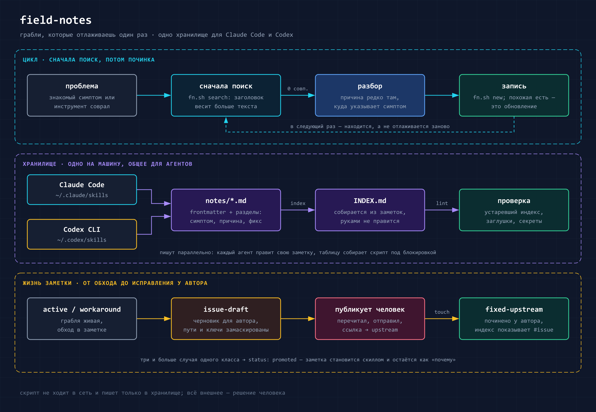

# field-notes


Скилл для ведения инженерных field notes — находок, которые переживают отдельный проект:
root cause, workaround, грабли инструмента, кандидаты в скиллы. Работает одинаково в
**Claude Code** и **Codex CLI**: формат `SKILL.md` у них общий, поэтому репозиторий
подключается ссылкой в оба каталога скиллов, а хранилище заметок одно на машину — что
записал один агент, находит другой.

[English version](README.md)

В репозитории лежит **только скилл**. Сами заметки остаются локально и в git не попадают:
в них конкретные пути, версии и детали проектов.

Старший брат для Hermes Agent — [hermes-field-notes](https://github.com/itpartypattaya/hermes-field-notes):
те же заметки плюс реестр локальных патчей ядра и Telegram-дашборд.

## Установка

```bash
git clone https://github.com/itpartypattaya/field-notes.git
```

Windows:

```
pwsh -File install.ps1
```

Linux / macOS:

```
sh install.sh
```

Скрипт создаёт junction (symlink) в `~/.claude/skills/field-notes` и `~/.codex/skills/field-notes`
для тех агентов, что установлены, и заводит пустое хранилище, если его ещё нет. Обновление —
`git pull` в этом каталоге, оба агента подхватят.

Нужен **Python 3.9+** (только стандартная библиотека). `fn.sh` сам выбирает интерпретатор:
`$FIELD_NOTES_PYTHON` → `py -3` → `python3` → `python`, каждый пробует запуском — заглушка
`python3` из Microsoft Store в PATH есть, но не работает. Без Python остаются `root`, `init`,
`new`, `grep` и `list`.

## Как устроено хранилище

Корень выбирается по порядку, первое совпадение выигрывает:

1. `$FIELD_NOTES_DIR`
2. `~/.claude/field-notes`
3. `~/.codex/field-notes`
4. иначе создаётся `~/.claude/field-notes`

```
<root>/
├── INDEX.md            собирается из заметок командой `index`, руками не правится
└── notes/
    └── YYYY-MM-DD-short-slug.md   frontmatter + разделы
```

Формат заметки и что проверяет `lint` — [`references/note-format.md`](references/note-format.md).

Если в глобальных инструкциях агента (`~/.codex/AGENTS.md`, `~/.claude/CLAUDE.md`) уже прописан
свой путь к заметкам, поставь туда тот же корень или `$FIELD_NOTES_DIR`: агент верит своим
инструкциям раньше, чем скиллу, и молча уйдёт во второе хранилище.

## Когда срабатывает

На просьбы записать — «запиши грабли», «давай запишем этот баг», «запиши решение в багфикс»,
«сохрани грабли», «remember this bug» — и на вопросы «мы такое уже видели?», «было уже такое?».
Сам, без просьбы, — перед починкой знакомого симптома и после разбора, где причина оказалась не
там, куда указывал симптом. Текст скилла на русском, фразы понимает на любом языке.

## Что делает скилл



- **Читает перед починкой.** Знакомый симптом — сначала `search`: поиск с ранжированием,
  совпадение в заголовке весит больше, чем в тексте, а русские окончания не мешают.
- **Пишет после разбора.** Если причина оказалась не тем, чем выглядел симптом, — заметка по
  шаблону: контекст, симптом дословно, root cause, фикс, проверяемый критерий, что увело не туда.
  `new` останавливается, если похожая заметка уже есть.
- **Обновляет, а не размножает.** Повтор той же грабли — блок «Обновление» в существующей заметке
  и `touch`.
- **Держит индекс в порядке.** `INDEX.md` собирается из frontmatter, поэтому параллельные сессии
  и разные агенты не затирают строки друг друга; `lint` ловит устаревший индекс, заглушки и то,
  что похоже на секрет.
- **Помогает отнести баг автору инструмента.** `issue-draft` собирает черновик issue из заметки
  и маскирует ключи, токены, домашние пути, IP и email; статус `fixed-upstream` и ссылка
  `upstream` показывают, где грабля уже исправлена.
- **Оценивает кандидатов в скиллы.** Заметка описывает случай, скилл — процедуру; критерий
  перехода описан в `SKILL.md`.

## Команды

```bash
sh scripts/fn.sh search <слова…>        # поиск с ранжированием (--status, --area, --json)
sh scripts/fn.sh grep '<строка>'         # сырой поиск точной строки
sh scripts/fn.sh new <slug> --title "…" --area "…"
sh scripts/fn.sh index                  # пересобрать INDEX.md
sh scripts/fn.sh lint                   # проверить хранилище
sh scripts/fn.sh touch <id> [--status fixed-upstream] [--upstream URL]
sh scripts/fn.sh issue-draft <id>       # черновик issue, ничего не публикует
sh scripts/fn.sh list | root | init
sh scripts/fn.sh migrate --from <root> [--apply]   # переход со старого формата 1.x
```

`--read-only` у любой команды гарантирует, что ничего не будет записано; `--json` — вывод для
машины. Сети скрипт не касается.

## Переход с 1.x

В 1.x метаданные были строкой `**Date:** · **Area:** · **Status:**`, а индекс вели руками.
Сделай копию хранилища, затем:

```bash
sh scripts/fn.sh migrate --from ~/.claude/field-notes            # пробный прогон
sh scripts/fn.sh migrate --from ~/.claude/field-notes --apply
sh scripts/fn.sh lint
```

Имена файлов не меняются, поэтому ссылки на заметки из других мест остаются рабочими. Что
куда переезжает — в [`references/note-format.md`](references/note-format.md).

## Тесты

```bash
python3 -m unittest discover -s tests
```

`evals/evals.json` — фразы, на которые скилл должен и не должен срабатывать; прогон ручной.

## Автор

Антон Васьков — Telegram [@passone](https://t.me/passone), GitHub [itpartypattaya](https://github.com/itpartypattaya).

## Лицензия

[MIT](LICENSE)
